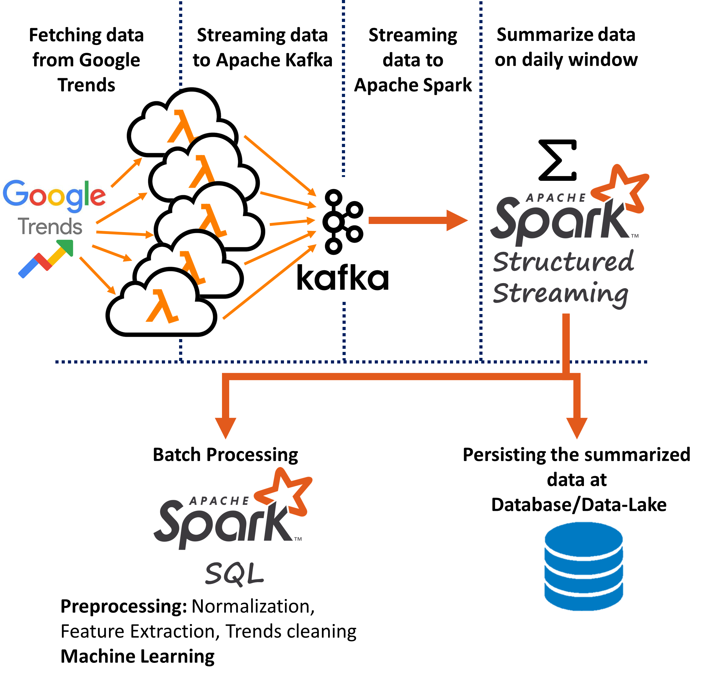
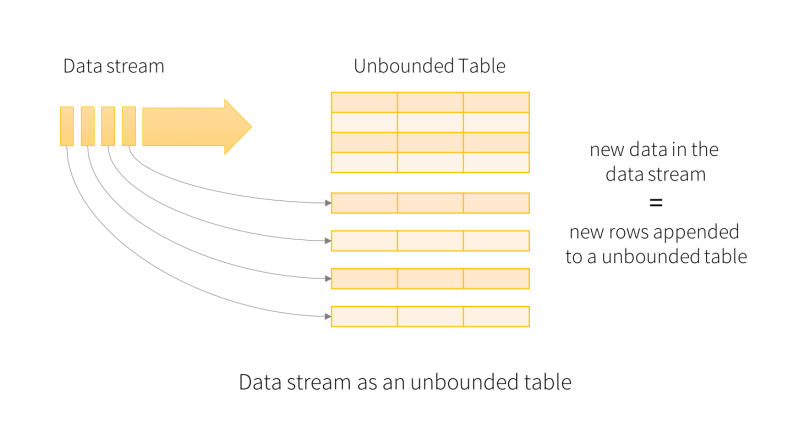
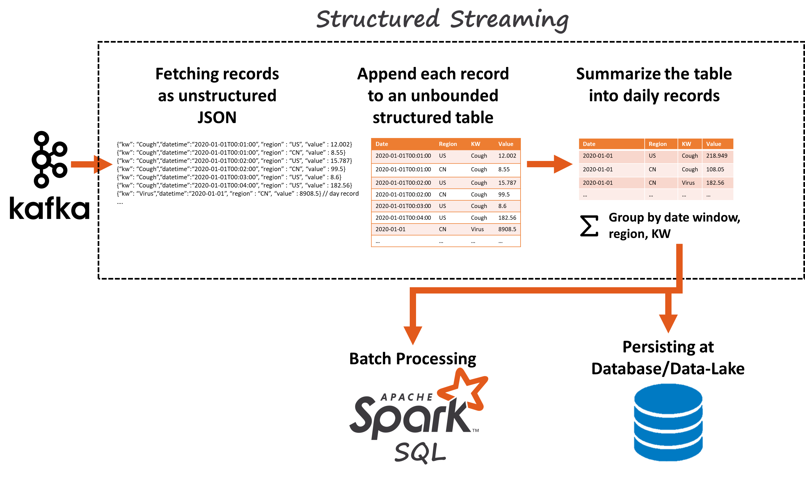
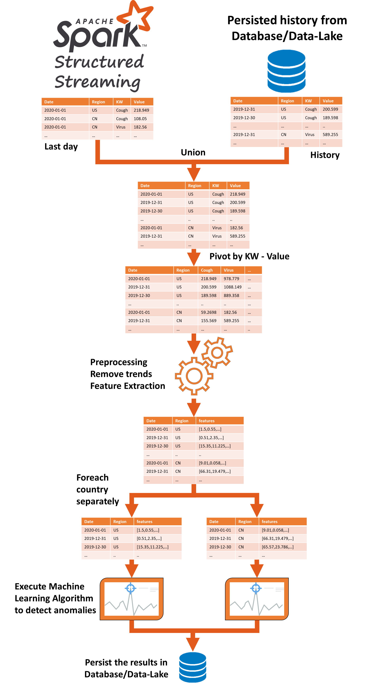
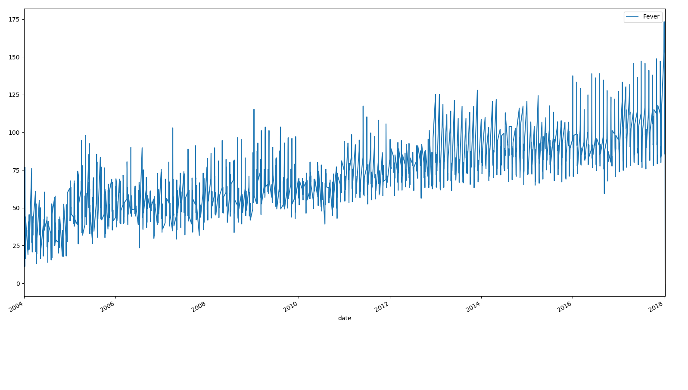
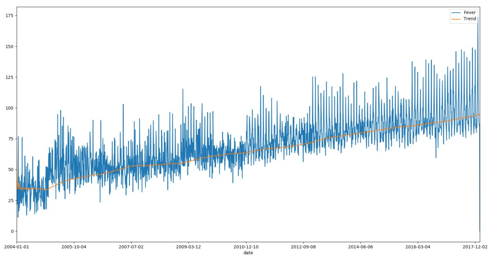
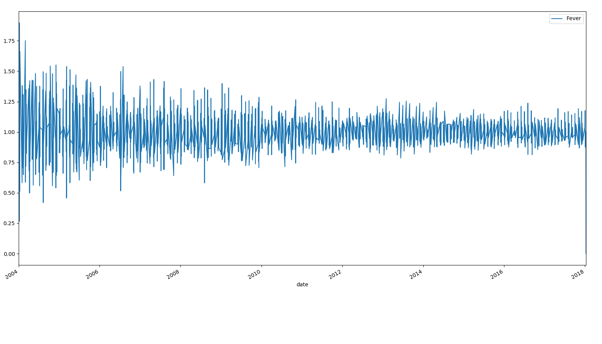
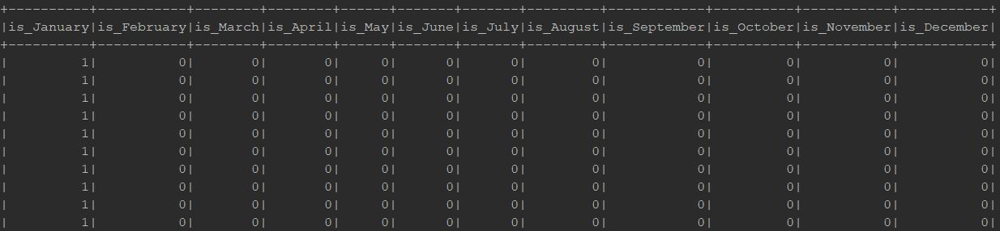
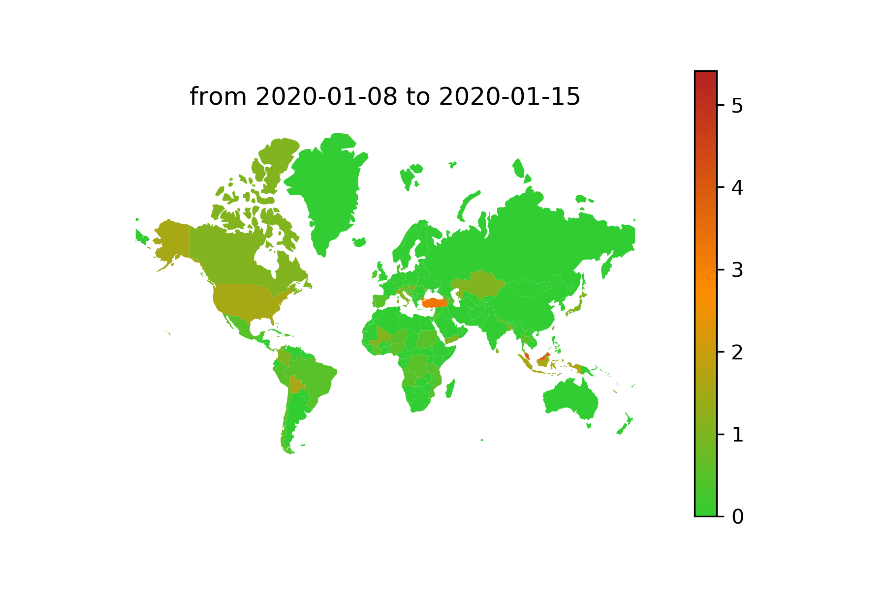

# Detecting Disease Outbreaks Over Big-Data Stream
### Class work for Big-Data Analysis

## Introduction
Diseases outbreaks can be characterized by an increasing amount of people that experience symptoms like cough,
cold, vomiting, infirmity, etc..  
In the digital age that we are living today, when anybody constantly using the internet,  
a significant outbreak, and increase in morbidity are certainly encoded with the network traffic.

Our goal is to daily recognize unusual events that can influence the morbidity levels worldwide.

This project demonstrates how to exploit Google search data to monitoring and recognizing anomalies within a specific field of interest (morbidity level).  

We are using daily streams of the Google search's statistics of 20 terms over 175 different countries, each term associated with the morbidity levels.  
In total, we are using 3500 different streams sources each one of them streams the search's statistics of 1 country and 1 term.  

Our system is  fully implemented with both Python and Scala languages (with few minor changes)

Note, this project focus on how to handle Big-Data and Big-Data Streams, and less about machine learning techniques.

### Big-Data and Big-Data Streams
Streaming data refers to data that is continuously generated, usually in high volumes and at high velocity.  
Common examples of streaming data include IoT sensors, Server and security logs, Real-time advertising, etc...  

This project uses 3500 streaming sources that stream the Google search data on a daily/hourly/minutely basis.  

It's easy to calculate that each streaming source can produce up to 1440 records a day (when works on a minute basis).  
When monitoring worldwide data over many terms this volume is multiplying.  

Our demonstration monitoring 20 search terms over 175 countries, so in total, our algorithm must handle up to 5,040,000 records a day.  
However, we designed our project the be able to easily scale up to monitor many more terms.  

Note that full implementation may require monitoring many more terms, so this number can be much higher.

#### To handle this much data we must use paralleled and distributed systems.
Our system must handle big-data in 4 different aspects:
1) Capture the streams from many different sources and centralize them in one accessible location.
2) Daily summarize and manipulate the data. 
3) Normalize and extract features from the data for preprocessing purposes.
4) Execute machine learning algorithms to detect anomalies in the data.

**This project exploits 2 mainstream platforms to handle big-data and big-data streams:**
1) **Apache Kafka**, to centralize and manage many streaming sources in one logical location.
2) **Apache Spark**, to summarize, preprocessing, and executing machine learning algorithms in a paralleled and distributed cluster.  

Both Apache Kafka and Apache Spark are distributed and scalable solutions that able to easily scale up when needed.

## High Level Architecture
Our system consist of 4 main components:
1) **Streaming Sources**, light-weighted lambda function that fetches data from Google Trends for 1 country and 1 term.  
this lambda runs on a large number of cloud computers in parallel.  
We must use a large number of different computers to overcome Google's limitation on the total number of queries that a source can make per day.
2) **Apache Kafka**, centralize the many streaming sources into a one combined and accessible stream.
3) **Apache Spark Structured Streaming**, fetching the combined stream from Kafka and summarizing the minutely/hourly/daily basis records into a unified daily basis records and persist them at a database/data-lake. 
4) **Apache Spark SQL**, daily batch analysis of the data using normalization, feature extracting, and machine learning algorithms to scan for anomalies.  

  

### Streaming Sources
Google Trends provides information about the quantity of a specific term searching in Google Search.

For accessing these data, we using  PyTrends API (Python) to fetch the records for each country and term.

Google Trends restriction is blocking from fetching a lot of data with one source:
- They are blocking the IP after 100 queries 
- Each query is limited to 1 hour for minutes records, 1 day for hourly records and 150 days for daily records

For this demonstration, we were required to make the historical dataset for each country and term from 2004 to now.
- 3500 combinations over more than 5700 days  

Moreover, we forced to make 3 times more queries than normal for accuracy and normalization purposes.

To construct the historical dataset we required for:
- 28,728,000,000 minutely based records - 1,436,400,000 queries 
- 478,800,000 hourly based records - 59,850,000 queries 
- 19,950,000 daily based records - 399,000 queries

For each new day:
- 8,208,000 minutely based records - 8,208,000 queries 
- 136,800 hourly based records - 136,800 queries 
- 5700 daily based records - 5700 queries


This task is feasible with the right amount of cloud computers.  
However, for money and time saving we fetched only daily basis records (and not minutely) for most of the countries.  

To fetch historical daily basis records we used over 300 different lambda instances that run at 30 different regions.


Fetching demonstration: (Term = Cough, Country = United States)
```python
pytrends = TrendReq(timeout=(5, 60 * 60))
pytrends.build_payload(['Cough'], timeframe="2020-01-01T20 2020-01-01T21",geo="US")
df = pytrends.interest_over_time()
df
```

<div>
<style scoped>
    .dataframe tbody tr th:only-of-type {
        vertical-align: middle;
    }

    .dataframe tbody tr th {
        vertical-align: top;
    }

    .dataframe thead th {
        text-align: right;
    }
</style>
<table border="1" class="dataframe">
  <thead>
    <tr style="text-align: right;">
      <th></th>
      <th>Cough</th>
      <th>isPartial</th>
    </tr>
    <tr>
      <th>date</th>
      <th></th>
      <th></th>
    </tr>
  </thead>
  <tbody>
    <tr>
      <td>2020-01-01 20:00:00</td>
      <td>76</td>
      <td>False</td>
    </tr>
    <tr>
      <td>2020-01-01 20:01:00</td>
      <td>61</td>
      <td>False</td>
    </tr>
    <tr>
      <td>2020-01-01 20:02:00</td>
      <td>55</td>
      <td>False</td>
    </tr>
    <tr>
      <td>2020-01-01 20:03:00</td>
      <td>82</td>
      <td>False</td>
    </tr>
    <tr>
      <td>2020-01-01 20:04:00</td>
      <td>76</td>
      <td>False</td>
    </tr>
    <tr>
      <td>...</td>
      <td>...</td>
      <td>...</td>
  </tbody>
</table>
<p>61 rows × 2 columns</p>
</div>


Lambda Function
```python
request_json = request.get_json(silent=True)
kw = request_json['kw']
region = request_json['region']
from_date = request_json['fromDate']
to_date = request_json['toDate']

# fetching data from Google Trends
df = get_interest_over_time(prev_df=None,
                            from_date=datetime.strptime(from_date, '%Y-%m-%d'),
                            to_date=datetime.strptime(to_date, '%Y-%m-%d'),
                            kw_list=[kw], geo=region,
                            correlation_size=60, progress_per_itr=30, min_correlation_pct=0.2,
                            q_noise_filter=1.2, drop_history_if_invalid=False)
res = []
 # each record:
 # {“kw”: “Cough”, “date”: “2020-01-01T00:01:00”, “region” : “US” , “value” :12 }
for date, row in df.iterrows():
    res.append({'datetime': date.isoformat(), "kw": kw, "region": region, "value": row[kw] })
data_json = jsonify(res)
# Stream to Kafka
producer = KafkaProducer(bootstrap_servers=['KAFKA_IP:9092'],
                                 value_serializer=lambda x:
                                 dumps(x).encode('utf-8'))
producer.send("KAFKA_TOPIC", value=data_json)
```


### Apache Kafka
Distributed streaming platform that used for two broad classes of applications:
- Building real-time streaming data pipelines that reliably get data between systems or applications
- Building real-time streaming applications that transform or react to the streams of data

In our solution we use kafka to centralize he huge number streaming sources into a one accessible logical location.  
We deployed kafka to a Kubernetes cluster using a docker-compose that defines Kafka configuration and how it 
interact with zookeeper. We defined Kafka with docker to simplify installation on the cloud and because you can easily 
create more instances of kafka in the docker-compose file.

Kafka DockerCompose 
```yaml
version: '3'
services:
  zookeeper:
    image: wurstmeister/zookeeper
    container_name: zookeeper
    ports:
      - "2181:2181"
 
  kafka:
    image: wurstmeister/kafka
    container_name: kafka
    ports:
      - "9092:9092"
    environment:
      KAFKA_BROKER_ID: 1
      KAFKA_ADVERTISED_HOST_NAME: kafka
      KAFKA_ZOOKEEPER_CONNECT: zookeeper:2181
```


to run kafka locally run:
```Bash
docker-compose up -f <path-to-compose.yml> -d
```
to deploy kafka to a k8s cluster run:
```Bash
kompose up -f <path-to-compose.yml> --server http://<server-ip>:<server-port>
```
If you don't know your cluster ip you get its info with:
```Bash
kubectl ckuster-info
```
To see all running services in k8s cluster run:
```Bash
kubectl get all
```


### Apache Spark
Open-source distributed general-purpose cluster-computing framework.  
Spark provides an interface for programming entire clusters with implicit data parallelism and fault tolerance.  
We also deployed spark to k8s cluster to easily scale-up the number of executors.  
MakeFile Script to automatically deploy spark to k8s cluster
```Bash
# Build the jar with all it's dependencies
gradle clean
gradle shadowJar

# Build the docker image of the project
docker build -t anomaly-disease .

# Start a local k8s cluster
minikube start

# submit spark job
spark-submit \
    --master k8s://https://192.168.64.3:8443 \
    --deploy-mode cluster \
    --name example \
    --conf spark.executor.instances=5 \
    --class Main \
    --conf spark.kubernetes.container.image=anomaly-disease \
    local:///opt/spark/work-dir/spark-main.jar

# stop the cluster
minikube stop
```

### Spark Structured Streaming
[Structured Streaming Programming Guide](https://spark.apache.org/docs/latest/structured-streaming-programming-guide.html "Structured Streaming Programming Guide")  
Spark Structured Streaming is a scalable and fault-tolerant stream processing engine built on the Spark SQL engine. You can express your streaming computation the same way you would express a batch computation on static data.  
The Spark SQL engine will take care of running it incrementally and continuously and updating the final result as streaming data continues to arrive.  

  

#### Spark Structured Streaming VS Spark Streaming 

| Spark Streaming (D-Streams)  | Spark Structured Streaming |
| ------------- | ------------- |
| RDD based streaming  | Dataframe/Dataset based streaming - More flexible then RDD |
| Specified micro-batch  |  Trigger interval, The received data in a trigger is appended to the continuously flowing data stream. Each row of the data stream is processed and the result is updated into the unbounded result table. | 
| Cant handle late data, only works with the timestamp when the data is received   | Can handle late data by process data base of event-time  |
| Kafka 0.8 support is deprecated as of Spark 2.3.  | Have full Kafka support|

Structured Streaming is more inclined to real-time streaming but Spark Streaming focuses more on batch processing. The APIs are better and optimized in Structured Streaming where Spark Streaming is still based on the old RDDs.

#### Our Structured Streaming Architecture

We are using Spark Structured Streaming for 3 main purposes:
1) Unmarshalling JSON stream into an unbounded structured table format
2) Summarize the minutely/hourly/daily data into a uniform daily table
3) Persist the data and trigger a batch processing when the daily data available

Also, our system must handle late data (up to 1 hour late).  

  

#### The Code

```scala
  private val spark = SparkSession.builder
    .config("spark.sql.shuffle.partitions", "8")  // Development Environment
    .master("local[*]") // Development Environment
    .appName("DiseaseDataC")
    .getOrCreate()
  import spark.implicits._

  //Subscribe to the Kafka stream
  var df = spark.readStream
    .format("kafka")
    .option("kafka.bootstrap.servers", "KAFKA_SERVER:9092")
    .option("subscribe", "KAFKA_TOPIC")
    .option("maxOffsetsPerTrigger", "1000")// Development Environment
    .option("startingOffsets", "earliest") // Development Environment
    .load()

  //Unmarshalling the JSON records into a structured table
  val tableSchema = StructType(
    Array(StructField("datetime", DateType),
      StructField("kw", StringType),
      StructField("region", StringType),
      StructField("value", DoubleType)
    ))


  //| datetime | region | kw | value |  
  df = df.selectExpr("CAST(key AS STRING)", "CAST(value AS STRING) as json")  
      .withColumn("JSON", from_json(col("JSON"), tableSchema))
      .select("JSON.*")
  // +-------------------+------+-------------------+-----+
  // |           datetime|region|                 kw|value|
  // +-------------------+------+-------------------+-----+
  // |2020-01-01 00:01:00|    US|              Virus|  9.0|
  // |2020-01-01 00:01:00|    US|           Vomiting|  0.0|
  // |2020-01-01 00:02:00|    US|           Vomiting|  4.0|
  // |2020-01-01 00:02:00|    CN|              Mucus|  0.0|
  // |      ......       |    ..|       .......     | ... |


  // Summarize the minutely/hourly/daily data into a uniform daily table
  // Handle late data (up to 1 hour late)
  //| window | date | region | kw | value |
  df = df.withColumn("kw", regexp_replace($"kw", " ", "_"))
      .withWatermark("datetime", "1 hour") // Wait upto 1 hour for late data
      .groupBy(window($"datetime", "1 day"), // 1 day window (take only the current day)
        to_date($"datetime",fmt = "yyyy-MM-dd").as("date"), // Sum by date (remove time)
        $"region", $"kw") 
      .agg(sum("value").as("value"))
  // +----------------------------------------+-----------+------+---------------+-----+
  // |                                 window |      date |region|             kw|value|
  // +----------------------------------------+-----------+------+---------------+-----+
  // |2020-01-01T00:00:00-2004-01-01T23:59:59 |2020-01-01 |    US|          Virus| 39.0|
  // |2020-01-01T00:00:00-2004-01-01T23:59:59 |2020-01-01 |    US|       Vomiting| 47.0|
  // |2020-01-01T00:00:00-2004-01-01T23:59:59 |2020-01-01 |    CN|          Mucus| 12.5|
  // |                ......                  |  ......   |    ..|     ......    | ... |

  df = df.drop("window")

  // Sink1 - Persist the data
  df.writeStream
    .foreachBatch { (batchDF: DataFrame, batchId: Long) =>
      persistBatchAtSql(batchDF, batchId)
    }
    .outputMode("append")
    .start()

  // Sink2 - trigger a batch processing
  df.writeStream
    .foreachBatch { (batchDF: DataFrame, batchId: Long) =>
      handleBatchProcessing(batchDF, batchId)
    }
    .outputMode("append")
    .start()
    .awaitTermination()
```

##### Sink 1 Persist the data
In our implementation we persisting the data in a cloud MySQL database, this can be changed to any database/data-lake like S3, Mongo, etc.. with minor changes.  
```scala
def persistBatchAtSql(batchDf: DataFrame, batchId: Long):Unit = {
  // save raw data in MySQL database
  batchDf.write.format("jdbc")
        .option("url", jdbcUrl)
        .option("driver", "com.mysql.cj.jdbc.Driver")
        .option("dbtable", tableName)
        .option("user", username)
        .option("password", password)
        .mode(SaveMode.Append)
        .save()
}
```
##### Sink 2 Batch Processing
this code will be specified at the Spark SQL section.
```scala
def handleBatchProcessing(batchDf: DataFrame, batchId: Long): Unit = { 
    // after the batch ended and the daily data is ready
    // normalization.
    // feature extracting.
    // scan for machine anomalies using learning algorithms.  
    ......
    ......
}
```


### Spark SQL
[Spark SQL Programming Guide](https://spark.apache.org/docs/latest/sql-programming-guide.html "Spark SQL Programming Guide")  

Spark SQL is a Spark module for structured data processing. Unlike the basic Spark RDD API, the interfaces provided by Spark SQL provide Spark with more information about the structure of both the data and the computation being performed.  
Spark SQL using DataFrame/DataSet, Dataset is a distributed collection of data. Dataset is a new interface added in Spark 1.6 that provides the benefits of RDDs (strong typing, ability to use powerful lambda functions) with the benefits of Spark SQL’s optimized execution engine. A DataFrame is a Dataset organized into named columns. It is conceptually equivalent to a table in a relational database or a data frame in R/Python, but with richer optimizations under the hood.  

From the user's eyes, the main difference between standard Spark RDDs and Spark SQL DataFrames is that Spark SQL can execute useful SQL queries on DataFrames (that could be a game-changer in many cases).  

In this project, we are using Spark SQL after the daily data (daily batch) is ready (collected an summarized by Spark Structured Streaming).  

Our batch analysis consist of 3 main phases:
1) Read the relevant history from the persisted database/data-lake (we uses MySQL) and merge it with the newly fetch data (recent day).  
2) Preparing the data for machine learning (normalization, feature extracting, etc...
3) Execute machine learning algorithm to determine if the recent day represent an unusual event that may influence the morbidity levels.  


#### Batch Processing Architecture
    

#### Preprocessing
Data preprocessing is an important step in the data mining process.
The main tasks for preprocessing are:  
- **Data Cleaning**- the process of detecting and correcting (or removing) corrupt or inaccurate records from a record set
- **Data Editing**-  adjustment of collected survey data.
- **Data Reduction**- transformation of numerical or alphabetical digital information derived empirically or experimentally into a corrected, ordered, and simplified form. (scaling, encoding, sorting, collating, producing tabular summaries, smoothing and interpolation)
- **Data Wrangling**- transforming and mapping data from one "raw" data form into another format with the intent of making it more appropriate and valuable for a variety of downstream purposes such as analytics.  

Our preprocessing involve 3 main stages:
1) Remove Trend from the data 
2) Add Months feature 
3) Prepare the dataframe for Machine Learning model 

##### Remove Trend
A trend is the general direction of a series, it can be linearly upwards, downwards, etc...   
In our case, a trend can indicate the rising number of Google Search users over the years (in 2020, there were far more network users than 2004).

Before fitting the machine learning model, we must remove the effect of the trend (a  trend can impact the detection of anomalies).  
One of the common procedures for detecting trends is by calculating the Moving Averages of the series.  

A good analogy for the moving average is ironing clothes to remove wrinkles.  
The idea with a moving average is to remove all the zigzag (wrinkle) movement from the time series to produce a constant trend using averages of adjacent values ​​for a time period.
> Fever feature in United States without trend cleaning
    

> Fever feature in United States with marked trend ( using Moving Average)  
> The trend can be explained by the increasing number of Google Search users over the years
  

> Fever feature after trend cleaning
  


##### Months features
Months feature it’s the column that represents the day of the week for each row data date.  
The purpose of this feature is to overcome the seasonality behavior of the graph.  
We used one-hot encoding encoder to perform “binarization” of the month's numeric value and include it as a feature to train the model.
Now for each row, there will be 12 new columns is_January, is_February... when 0 indicates non-existent while 1 indicates existent. For example, 10/26/2016 is October so the column is_October will have the value 1 and all the other columns will have value 0.
  > Sample of Month feature
    


#### Preprocessing Code
```scala
// batchDf:
// +-----------+------+---------------+-----+
// |      date |region|             kw|value|
// +-----------+------+---------------+-----+
// |2020-01-01 |    US|          Virus| 39.0|
// |2020-01-01 |    US|       Vomiting| 47.0|
// |2020-01-01 |    CN|          Mucus| 12.5|
// |  ......   |    ..|     ......    | ... |
// fetch relevant history from the persisted database
val thisDate = batchDf.first().getAs[java.sql.Date]("date")
// thisDate = 2020-01-01
// fetch history from DB
val historyDf = spark.read.format("jdbc")
  .option("url", jdbcUrl)
  .option("driver", "com.mysql.cj.jdbc.Driver")
  .option("dbtable", tableName)
  .option("user", username)
  .option("password", password)
  .load().where($"date" < lit(thisDate))
// historyDf:
// +-----------+------+---------------+-----+
// |      date |region|             kw|value|
// +-----------+------+---------------+-----+
// |2019-12-31 |    US|          Virus| 19.5|
// |2019-12-31 |    US|       Vomiting| 48.6|
// |2019-12-31 |    CN|          Mucus| 20.2|
// |  ......   |    ..|     ......    | ... |
println("history dataframe")
historyDf.show() // DEBUG
// Combine the historical Dataframe with the newly received last day's Dataframe
var df = batchDf.union(historyDf)
//     .where($"region" === "US") // DEBUG
println("batch dataframe + history dataframe")
df.show() // DEBUG
// +-----------+------+---------------+-----+
// |      date |region|             kw|value|
// +-----------+------+---------------+-----+
// |2020-01-01 |    US|          Virus| 39.0|
// |2020-01-01 |    US|       Vomiting| 47.0|
// |2020-01-01 |    CN|          Mucus| 12.5|
// |  ......   |    ..|     ......    | ... |
// |2019-12-31 |    US|          Virus| 19.5|
// |2019-12-31 |    US|       Vomiting| 48.6|
// |2019-12-31 |    CN|          Mucus| 20.2|
// |  ......   |    ..|     ......    | ... |
// Calculate Trends using Moving Average
df = df.withColumn("movingAverage", avg(col("value"))
  .over(Window.partitionBy(col("kw"), col("region"))
    .orderBy(col("date").asc)
    .rowsBetween(Long.MinValue, 0)))
println("dataframe with trends")
df.show(100)
// +-----------+------+---------------+-----+-------------+
// |      date |region|             kw|value|movingAverage|
// +-----------+------+---------------+-----+-------------+
// |2020-01-01 |    US|          Virus| 39.0|         30.5|
// |2020-01-01 |    US|       Vomiting| 47.0|         14.1|
// |2020-01-01 |    CN|          Mucus| 12.5|         12.2|
// |  ......   |    ..|     ......    | ... |         ... |
// |2019-12-31 |    US|          Virus| 19.5|         30.3|
// |2019-12-31 |    US|       Vomiting| 48.6|         14.9|
// |2019-12-31 |    CN|          Mucus| 20.2|         12.1|
// |  ......   |    ..|     ......    | ... |         ... |
// Remove the Trends
// the average value could be zero, dividing by zero causing NaN
// clean NaN and nulls with 1 (avg)
df = df.withColumn("value", df.col("value") / df.col("movingAverage"))
  .drop("movingAverage")
  .withColumn("value",
    when($"value".isNull.or($"value" === lit(Double.NaN)), 1)
      .otherwise(col("value")))
println("dataframe after remove trends")
df.show()
// +-----------+------+---------------+-----+
// |      date |region|             kw|value|
// +-----------+------+---------------+-----+
// |2020-01-01 |    US|          Virus| 1.27|
// |2020-01-01 |    US|       Vomiting| 3.33|
// |2020-01-01 |    CN|          Mucus| 1.02|
// |  ......   |    ..|     ......    | ... |
// |2019-12-31 |    US|          Virus| 0.64|
// |2019-12-31 |    US|       Vomiting| 3.26|
// |2019-12-31 |    CN|          Mucus| 1.66|
// |  ......   |    ..|     ......    | ... |
// Pivot the table by KW - Value
df = df.groupBy($"date", $"region")
  .pivot("kw")
  .agg(first("value"))
  .sort("date")
  .na.fill(0) // fill missing/NaN values with zero
println("pivoted dataframe after union")
df.show()
// +-----------+------+------+---------+------+-----+
// |      date |region| Virus| Vomiting| Mucus| ... |
// +-----------+------+------+---------+------+-----+
// |2020-01-01 |    US|  1.27|     3.33|  1.55| ... |
// |2020-12-31 |    US|  0.64|     3.26|  1.44| ... |
// |  ......   |   ...|  ... |     ... |  ... | ... |
// |2020-01-01 |    CN|  7.29|    1.633|  1.02| ... |
// |2019-12-31 |    CN|  5.99|    1.022|  1.66| ... |
// |  ......   |   ...|  ... |     ... |  ... | ... |
//Add One-Hot month feature
val monthList = List("is_January", "is_February", "is_March", "is_April", "is_May", "is_June",
  "is_July", "is_August", "is_September", "is_October", "is_November", "is_December")
val getMonthStrUdf = udf((monthNum: Int) => monthList(monthNum - 1)) //from month num t
val isMonthDf = df.withColumn("monthNumber", month(col("date")))
  .withColumn("monthNumber", getMonthStrUdf($"monthNumber"))
  .select($"date", $"region", $"monthNumber")
  .groupBy($"date", $"region")
  .pivot($"monthNumber")
  .count().na.fill(0)
println("one hot month features dataframe")
isMonthDf.show()
// one hot month features dataframe
// +----------+------+-----------+----------+
// |      date|region|is_December|is_January|
// +----------+------+-----------+----------+
// |2020-01-01|    US|          0|         1|
// |2019-12-31|    US|          1|         0|
// +----------+------+-----------+----------+
df = df.join(isMonthDf, Seq("date", "region"))
println("dataframe after join withOne-Hot month features ")
df.show()
// +-----------+------+------+---------+------+-----+-----------+----------+-----+
// |      date |region| Virus| Vomiting| Mucus| ... |is_December|is_January| ... |
// +-----------+------+------+---------+------+-----+-----------+----------+-----+
// |2020-01-01 |    US|  1.27|     3.33|  1.55| ... |          0|         1| ... |
// |2020-12-31 |    US|  0.64|     3.26|  1.44| ... |          1|         0| ... |
// |  ......   |   ...|  ... |     ... |  ... | ... |       ... |      ... | ... |
// |2020-01-01 |    CN|  7.29|    1.633|  1.02| ... |          0|         1| ... |
// |2019-12-31 |    CN|  5.99|    1.022|  1.66| ... |          1|         0| ... |
// |  ......   |   ...|  ... |     ... |  ... | ... |       ... |      ... | ... |
//convert features columns into one features vector
val featuresColumns = df.drop("date", "region").columns //[Virus,Vomiting,Mucus,...]
val assembler = new VectorAssembler()
  .setInputCols(featuresColumns) //all feature columns in df
  .setOutputCol("features")
df = assembler
  .transform(df)
  .select("features", "date", "region") //optional
df.show()
// +-----------+------+--------------------------+
// |      date |region|                  features|
// +-----------+------+--------------------------+
// |2020-01-01 |    US| [1.27,3.33,...,0, 1,...] |
// |2020-12-31 |    US| [0.64,3.26,...,1, 0,...] |
// |  ......   |   ...|                      ... |
// |2020-01-01 |    CN| [7.29,1.633,..,0, 1,...] |
// |2019-12-31 |    CN| [5.99,1.022,..,1, 0,...] |
// |  ......   |   ...|                      ... |

// The dataframe is ready for machine learning
//... execute a machine learning algorithm for each region ...
```

#### Machine Learning
Machine learning (ML) is the study of computer algorithms that improve automatically through experience.  
Machine learning algorithms build a mathematical model based on sample data, known as "training data", in order to make predictions or decisions without being explicitly programmed to do so.

This project uses machine learning to identify unusual events (outliers) in the series of data.
To solve this problem we tried 2 different approaches:
1) Isolation Forest (in the Scala implementation)
2) KMean (in the Python implementation)

##### Isolation Forest
Isolation forest it’s a method we use to finding Anomalies.  
Through isolation forest we present our data as a dots in a coordinate system, randomly select a dimension and a value, drawing a “line” that split two areas.
We repeat these actions until our tree is complete and repeat until we got a forest.
The Anomalies will be isolated quickly by our drawing lines and we find them after a few steps are building the forest.
```scala
// region = US
val regionDf = df.filter($"region" === region)
val historyDf = regionDf.where($"date" < lit(thisDate)) //thisDate = 2020-01-01
val todayDF = regionDf.where($"date" === lit(thisDate))
// regionDf
// +-----------+------+--------------------------+
// |      date |region|                  features|
// +-----------+------+--------------------------+
// |2020-01-01 |    US| [1.27,3.33,...,0, 1,...] |
// |2020-12-31 |    US| [0.64,3.26,...,1, 0,...] |
// |  ......   |   ...|                      ... |
val isolationForest = new IsolationForest()
  .setNumEstimators(100)
  .setBootstrap(false)
  .setMaxSamples(numOfSamples)
  .setMaxFeatures(1.0)
  .setFeaturesCol("features")
  .setPredictionCol("predictedLabel")
  .setScoreCol("outlierScore")
  .setContamination(0)
  .setRandomSeed(1)
val isolationForestModel = isolationForest.fit(historyDf) // fit on historical dat
val dataWithScores = isolationForestModel.transform(todayDF) // transform the curr
dataWithScores.show()
// +-----------+------+--------------------------+--------------+------------+
// |      date |region|                  features|predictedLabel|outlierScore|
// +-----------+------+--------------------------+--------------+------------+
// |2020-01-01 |    US| [1.27,3.33,...,0, 1,...] |             0|       0.011|
// +-----------+------+--------------------------+--------------+------------+
```


##### KMean Clustering
Cluster analysis or clustering is the task of grouping a set of objects in such a way that objects in the same group (called a cluster) are more similar (in some sense) to each other than to those in other groups (clusters).  
k-means clustering is a method of vector quantization, originally from signal processing, that aims to partition n observations into k clusters in which each observation belongs to the cluster with the nearest mean (cluster centers or cluster centroid).  

The Hypothesis is that unusual events are characterized by being far from their Cluster center compared to the rest of the events.  
By locating the clusters and measuring the distance between each event to its closest cluster, we can identify the farthest events as outliers 

```python
# normalize data's features by z-score (std=1, mean=0)
from pyspark.ml.feature import StandardScaler
scaler = StandardScaler(inputCol="features", outputCol="scaled_features",
                        withStd=True, withMean=True)

# Compute summary statistics by fitting the StandardScaler
scaler_model = scaler.fit(data)
scaled_data = scaler_model.transform(data).drop("features").withColumnRenamed('scaled_features','features')
scaled_data.show(2)
#+--------------------+-------------------+--------------------+
#|            features|               date|     scaled_features|
#+--------------------+-------------------+--------------------+
#|[0.0,72.0,94.0,10...|2004-01-01 00:00:00|[-2.7931557899775...|
#|[66.0,60.0,59.0,2...|2004-01-02 00:00:00|[0.01874477129218...|
#+--------------------+-------------------+--------------------+
#only showing top 2 rows

# reduce dimantion by PCA feature transformer
from pyspark.ml.feature import PCA
pca = PCA(k=4, inputCol="features", outputCol="pca_features")
pca_model = pca.fit(scaled_data)
pca_result = pca_model.transform(scaled_data).drop("features").withColumnRenamed('pca_features','features')
pca_result.show(2)
#+-------------------+--------------------+
#|               date|            features|
#+-------------------+--------------------+
#|2004-01-01 00:00:00|[2.75566526065209...|
#|2004-01-02 00:00:00|[2.71959250860813...|
#+-------------------+--------------------+
#only showing top 2 rows# select K (number of clusers) by silhouette's score

def select_k(dataset,k_range ,random_state=None,do_print=False):
    max_k = None
    max_avg_k = None
    evaluator = ClusteringEvaluator()
    for k in k_range:
        if do_print:
            print(f'clalculating k={k}')
        # Trains a k-means model.
        kmeans  = KMeans().setK(k).setSeed(1).fit(dataset)
        # Make predictions
        predictions = kmeans.transform(dataset)
        silhouette_avg =  evaluator.evaluate(predictions)
        if  max_k is None or silhouette_avg > max_avg_k:
            max_k , max_avg_k = k, silhouette_avg
            if do_print:
                print(f'max k={max_k}, silhouette_avg={max_avg_k}')
    return max_k 
k = select_k(dataset,range(2,7),do_print=True)
print(f'selected k:{k}')
#clalculating k=2
#max k=2, silhouette_avg=0.6560627400318632
#clalculating k=3
#max k=3, silhouette_avg=0.6761349279741743
#clalculating k=4
#clalculating k=5
#clalculating k=6
#selected k:3

# create a KMean clustering model and cluster the data ('features')
# Trains a k-means model.
kmeans = KMeans().setK(k).setSeed(1)
model = kmeans.fit(dataset)
# Make predictions
predictions = model.transform(dataset)
# Shows the result.
centers = model.clusterCenters()
print(f'Cluster Centers: {centers} ')  
predictions.show(3) 
#Cluster Centers: [array([-6.72408486, -1.53881906,  1.04642048, -0.09144765]), array([ 3.43041146, -0.5833448 ,  0.00767498, -0.00437638]), array([-1.91032674,  0.87734099, -0.22291329,  0.02304035])] 
#+-------------------+--------------------+----------+
#|               date|            features|prediction|
#+-------------------+--------------------+----------+
#|2004-01-01 00:00:00|[2.75566526065209...|         1|
#|2004-01-02 00:00:00|[2.71959250860813...|         1|
#|2004-01-03 00:00:00|[2.11668035480570...|         1|
#+-------------------+--------------------+----------+
#only showing top 3 rows
 
def calculate_distance(features,prediction):
    center = centers[int(prediction)]
    return float(features.squared_distance(center))

udf_translate = udf(translate, ArrayType(DoubleType()))
udf_calculate_distance = udf(calculate_distance, DoubleType()) 

tmp = predictions.withColumn("distance",udf_calculate_distance('features','prediction'))
df_stats = tmp.select(
    _mean(col('distance')).alias('mean'),
    _stddev(col('distance')).alias('std')
).collect()[0]

distances_mean = df_stats['mean']
distances_std = df_stats['std']
print(f'distances mean:{distances_mean}, std:{distances_std}')
#distances mean:5.892223045643053, std:33.443108374485014

# normalize the distances by z-score (mean=0, std=1)
diatances_assembler = VectorAssembler()\
      .setInputCols(['distance'])\
      .setOutputCol('distance_v')

diatances_data = diatances_assembler\
      .transform(tmp).drop("distance").withColumnRenamed('distance_v','distance')

diatances_scaler = StandardScaler(inputCol="distance", outputCol="scaled_distance",
                        withStd=True, withMean=True)

# Compute summary statistics by fitting the StandardScaler
diatances_scaler_model = diatances_scaler.fit(diatances_data)
diatances_scaler_data = diatances_scaler_model.transform(diatances_data)\
    .drop("distance").withColumnRe# show distances that exceed the boundaries as outliers
first_element=udf(lambda v:float(v[0]),DoubleType())
diatances_scaler_data.where(first_element('distance' > 2) )\
    .show(10)
#+-------------------+--------------------+----------+--------------------+
#|               date|            features|prediction|            distance|
#+-------------------+--------------------+----------+--------------------+
#|2020-03-09 00:00:00|[-12.101905466922...|         0|[2.9050237178837337]|
#|2020-03-10 00:00:00|[-13.329292403489...|         0|[4.8176695614385014]|
#|2020-03-11 00:00:00|[-14.240059796637...|         0| [7.270441795196232]|
#|2020-03-12 00:00:00|[-19.928794448505...|         0|[24.649256598072814]|
#|2020-03-13 00:00:00|[-20.323300103831...|         0|[23.275286686885934]|
#|2020-03-14 00:00:00|[-21.471956937061...|         0|[20.319729230214545]|
#|2020-03-15 00:00:00|[-21.185721197494...|         0| [20.00482072780182]|
#|2020-03-16 00:00:00|[-20.246439696490...|         0| [21.42602768115987]|
#|2020-03-17 00:00:00|[-20.098471292476...|         0|[20.945159388374325]|
#|2020-03-18 00:00:00|[-20.257046648872...|         0| [19.84132264159401]|
#only showing top 10 rows
```

### Results
We tested our system over the first months of 2020 (Corona-Virus outbreak).  
Note: some countries staying green for the entire timeline due to the lack of data for those countries.
Our results over 2020:
  

We can clearly see that in beginning of 2020 most of the world is completely green (regular condition).  

There are few countries with orange color that may indicate a seasonal flu that is more severe than usually or in China the CoronaVirus.  

After the 22 in January China Announced the CoronaVirus is able to spread between people.We can clearly see a big rise in interest of flu related symptoms almost in the entire world while China is the country with the most interest which fits with the fact the CoronaVirus spread at the time only in China.  

In the next few weeks we can see a decrease in anomaly level in most countries until we reach mid-February where we can see a spike in a few countries: Italy, Germany, Iran, Vietnam, South Korea and Japan which is also corresponding with the fact that those countries were the first countries to heavily suffered from the CoronaVirus.  

In the next week more the anomaly level of those countries grew even more with more countries turning red on the map.  

The next few weeks shows a big increase in anomaly level in most countries of the world while the US is the country with the highest anomaly level but China on the other hand have a very small anomaly level.  

After that we can see a decrease in anomaly level for most of the world which can show that quarantine worked or that people “got used” to the CoronaVirus.  

The last week shows ones again a big spike in the entire world. It is still hard to know why, could be because a lot of countries tried to stop the quarantine and return to a more “normal” life which lead to the morbidity increased again in those countries.  

### Conclusion
Our goal was to create a disease outbreaks monitoring system using big data and machine learning techniques on data that we gathered from Google Search worldwide.  
The final result clearly shows that large pandemics such as swine flu, bird flu, and CoronaVirus could be easily identified.  
Moreover, we noticed various other diseases outbreaks and some years that a certain illness was more powerful.  
However, for some countries (mostly from sain and Africa), it was much harder to get reasonable results, thanks to a lack of Google activities.
